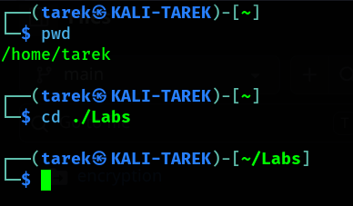
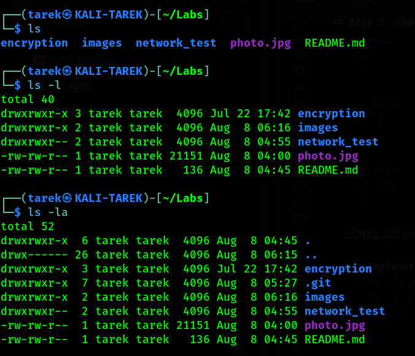
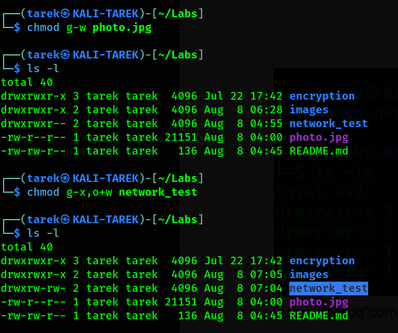

# Linux File Permission Configuration

These are simple instructions about how to use Linux commands to alter files permissions.


## Step 1: Define current location and change it

First, we want to know in which directory we are right now. Then, we will move to another sub-directory we want to modify its permissions.

  ```bash
  pwd
  ```

  ```bash
  cd ./Labs
  ```

  
    
  ### Explanation
  - `pwd` is used to display the current working directory.
  - `cd` -which stands for "change directory"- is used to change the current directory.
  - `./Labs` specifies the `Labs` directory which is located in the current directory.

  > **Note:** `./` refers to the current directory.


## Step 2: Check files or directories details

After moving to the required directory, we will use some commands to define the details about files and directories.

  ```bash
  ls
  ```

  ```bash
  ls -l
  ```

  ```bash
  ls -la
  ```

  

  ### Explanation
  - `ls` is used to list the contents of the current directory.
  - `ls -l` is used to display the permissions of files and directories.
  - `ls -la` is used to display the permissions of files and directories including hidden ones.
  - The permissions string consists of a 10-character string.
  - The first character demonstrates the file type, such as a regular file `-` or a directory `d`.
  - The next nine characters represent the permissions for the user, group, and others.
  - The first three characters represent the user's permissions.
  - The next three characters represent the group's permissions.
  - The last three characters represent the permissions for other.
  - `r` `w` and `x` represent "read", "write" and "execute".

  > **Note:** If one permission is revoked, it will be assigned as a hyphen `-`.


## Step 3: Modify permissions

If we want to change the permissions of any file, such as `photo.jpg`, to revoke write permissions of the group, we will use the `chmod` command -which stands for "change mode"-.

  ```bash
  chmod g-w photo.jpg
  ```

Now, to outline the changed we made, we use `ls -l` -we can use `ls -la` as well-.

  ```bash
  ls -l
  ```

  

  ### Explanation
  - `chmod` is used to modify file permissions and it requires a mode and one or more files.
  - `g-w` removes group's write permissions.
  - `photo.jpg` is the file whose permissions we are modifying.

  > **Note:** `chmod` can contain letters and operators such as `+`, `-` or `=`. It can contain digits indicating permission values as well.
  > **Note:** We can modify more than one permission by separating them with comma `,`.


## Commands Used

  ```bash
  pwd
  cd ./relevant_path
  ls
  ls -l
  ls -la
  chmod [who][operator][permission] file.txt
  ```


```markdown
## What I Learned

- How to interact with the Linux command line.
- How Linux file permissions work and how to modify them.
- How to inspect file and directory details using Linux commands.
```


## License

This project is for educational purposes only.
